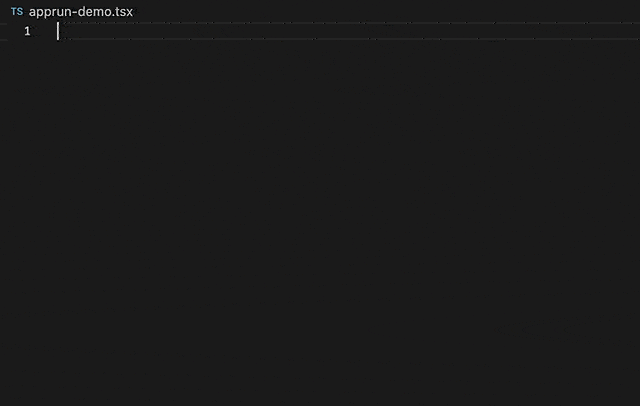

# Architecture Overview

Application logic is broken down into three separated parts in the AppRun architecture.

* State (a.k.a. Model) — the state of your application
* View — a function to display the state
* Update — a collection of event handlers to update the state

Use a _Counter_ as an example.




### State

The _state_ can be any data structure, a number, an array, or an object that reflects the state of the application. In the _Counter_ example, it is a number.

```javascript
const state = 0;
```

!!! note
    You define the initial state. AppRun manages the state. Therefore the initiale state is an immutable constatnt.

### View

The _view_ generates Virtual DOM based on the state. AppRun calculates the differences against the web page element and renders the changes.

```javascript
const view = state => <div>
  <h1>${state}</h1>
  <button $onclick="-1">-1</button>
  <button $onclick="+1">+1</button>
</div>;
```

!!! note
    AppRun allows you to choose your favorite virtual DOM technology in the _view_ function. The example above uses JSX. You can also use lit-html, uhtml and etc.

### Update

The _update_ is a collection of named event handlers, or a dictionary of event handlers. Each event handler creates a new state from the current state.
```javascript
const update = {
  '+1': state => state + 1,
  '-1': state => state - 1
}
```

!!! note
    There are a ew other ways to define event handlers.


When the three parts, the _state_, _view_, and _update_ are provided to AppRun to start an application, AppRun registers the event handlers defined in the _update_ and waits for AppRun events.

## Try it Online

You can run the _Counter_ example above locally or use the following online editors.

* [AppRun Playground](https://apprun.js.org/#play)
* [glitch](https://glitch.com/~apprun-counter).
* [repl.it](https://repl.it/@yysun/apprun-counter)
* [jsfiddle](https://jsfiddle.net/ap1kgyeb/4)


