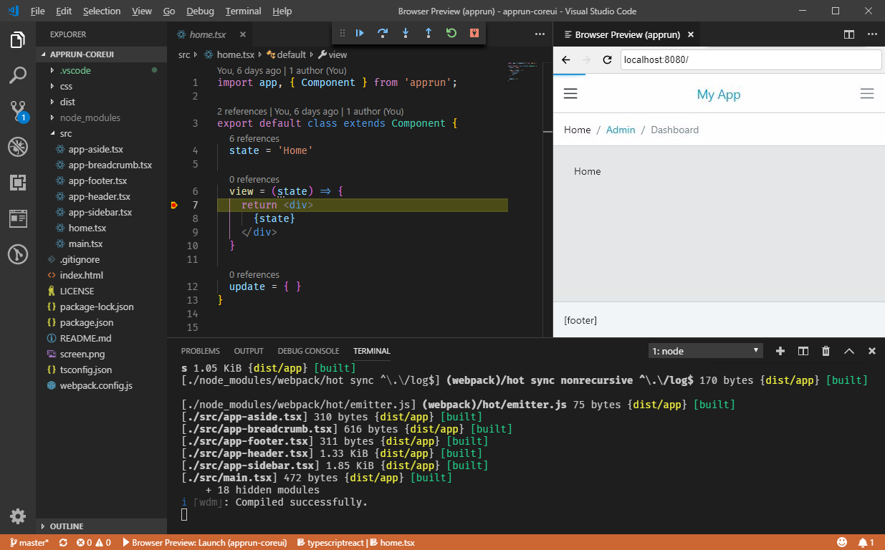

# AppRun CLI

You can use the AppRun CLI to create a TypeScript and webpack configured project for real-world application development. You will get a productive development environment in Visual Studio Code.

### TypeScript and WebPack

```sh
npx apprun --init
```




## esbuild

You can initialize a project that uses [esbuild](https://esbuild.github.io/).

```sh
npx apprun --init --esbuild
```

## Run and Build

AppRun applications use the following convention.

* Use _npm start_ to start the dev server
* Use _npm test_ to run unit tests
* Use _npm run build_ to build for production