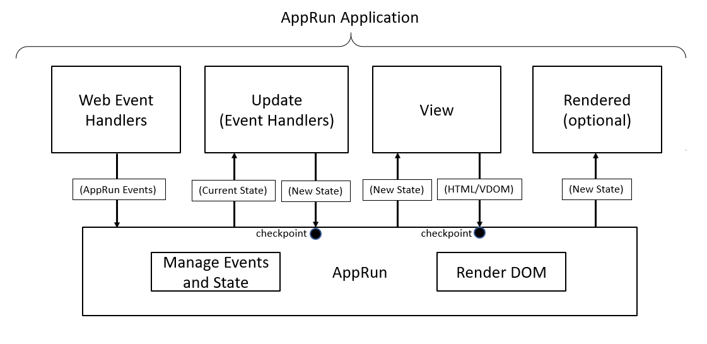

# Event Pub-Sub

Event publication and subscription, also known as event emitter, is a commonly used pattern in JavaScript programming.

* Publishing an event means raising an event for some other code to handle. Publishing an event is also referred to as firing an event or
triggering an event.
* Subscribing an event means registering an event handler function to the event. The event handler function executes when the correspondent event

At the core, AppRun is an event pub-sub system.

## Event Life Cycle

When an AppRun event is published, the following steps take place:

1. AppRun dispatches the events to the event handlers defined in the _update_ along with the _current state_.
2. The event handlers create _a new state_ based on the _current state_.
3. AppRun passes the _new state_ to the _view_ function.
4. The _view_ function creates HTML or a Virtual DOM.
5. AppRun renders the HTML/Virtual DOM to the screen
6. AppRun calls the optional _rendered_ function to complete the AppRun event life cycle.




AppRun Event Life Cycle connects the _state_, _view_, and _update (event handlers)_ together. Take a look at the _Counter_ example again.

```js
const state = 0;
const view = state => {
  return `<div>
    <h1>${state}</h1>
    <button onclick='app.run("-1")'>-1</button>
    <button onclick='app.run("+1")'>+1</button>
  </div>`;
};
const update = {
  '+1': state => state + 1,
  '-1': state => state - 1
};
app.start(document.body, state, view, update);
```
<apprun-code></apprun-code>

When one of the buttons is clicked, it publishes AppRun event +1 or -1. The event handlers increase or decrease the state and return a new state. The view function creates the virtual DOM using the new state. Finally, AppRun renders the virtual DOM.

## Event Scope

In AppRun global application mode, events are global events, which means that events are published and handled globally by all modules.

In AppRun [components](component.md), events are limited within the component's local scope. Local events are only available inside the components.

!!! note
    _app.run_ publishes global events
    _this.run_ publishes local events

## Event Directives

In addition to using _app.run_ and _this.run_ for publishing events

[AppRun Directives](directive.md) provides syntax sugar to simplify event publishing.


### JSX Directives

The directives are special HTML attributes with names starting with $, such as _$onclick_. They are extensions to the JSX syntax to simplify the JSX or add extra features.

We can use _$onclick_ to simplify the syntax of publishing AppRun events from

```js
<button onclick={()=>app.run('+1')}>+1</button>
```

to
We use tuples for passing event parameters.

```js
<button $onclick={['add', +1]}>+1</button>
```

Also, the _$onclick_ directive can call the event directly.

```js
const add = count => count + 1;
const view = count => <button $onclick={add}>
  Clicks: {count}
</button>;
app.start(document.body, 0, view);

```
<apprun-code></apprun-code>

You can see, because there are no events in this case, we don't need the _update_ object anymore.

### lit-html Directive

[lit-html](https://lit-html.polymer-project.org) is the DOM rendering technology that lets us write HTML templates using [string literals](https://developer.mozilla.org/en-US/docs/Web/JavaScript/Reference/Template_literals).


Following the idea of using the JSX _event directive_ what can we do similar thing with lit-html?


The good news is that lit-html also has the directive concept to bring the _event directive_ to lit-html. So the directive for lit-html is called _run_.

The example below shows how to use the _run_ directive to trigger AppRun events. Also, similar to the JSX event directives, the _run_ directive can call the event lifecycle directly.

```js
const add = (state, delta) => state + delta;
const view = state => {
  return html`<div>
    <h1>${state}</h1>
      <button @click=${run('add', -1)}>-1</button>
      <button @click=${run('add', +1)}>+1</button>
    </div>`;
};
app.start(document.body, 0, view, {add});
```
<apprun-code></apprun-code>

The _run_ directive will:

* Call the _add_ function
* Call the _view_ function
* Render the HTML element (document.body)


## Asynchronous Events

In the service API-oriented applications, the state is created asynchronous operations. e.g., getting remote data from the server.

It is easy to handle asynchronous operations in the AppRun event handlers. We only need to add the _async_ keyword in front of the event handler and call the functions that return a _Promise_ object with the _await_ keyword.

```js
const state = {};
const view = state => <>
  <div><button $onclick="fetchComic">fetch ...</button></div>
  {state.loading && <div>loading ... </div>}
  {state.comic && }
</>;
const update = {
  'loading': (state, loading) => ({...state, loading }),
  'fetchComic': async _ => {
    app.run('loading', true);
    const response = await fetch('https://my-xkcd-api.glitch.me');
    const comic = await response.json();
    return {comic};
  }
};
app.start(document.body, state, view, update);
```
<apprun-code style="height:300px"></apprun-code>

## Use Events for Everything

Web programming is event-driven. All we have to do is to convert DOM events to AppRun events to trigger the AppRun event life cycle.

```
DOM events => AppRun Events => (current state) => Update => (new state) => View => (HTML/Virtual DOM) => Render Web Page
```

Events are not only for handling user interactions. They are used for everything in AppRun.

* [Routing](routing.md) is through events.
* [Directives](directive.md) are through events.

## Event Typing

Events can be strongly typed using TypeScript Discriminated Unions. If you are interested, please read this post: [strong-typing](strong-typing.md).

