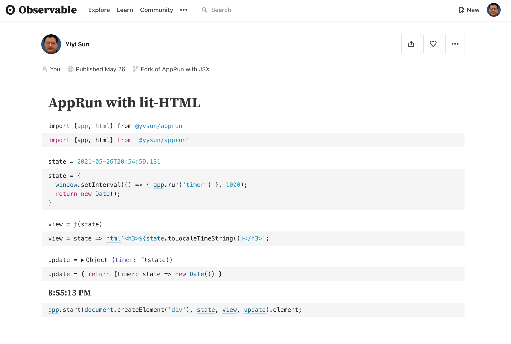
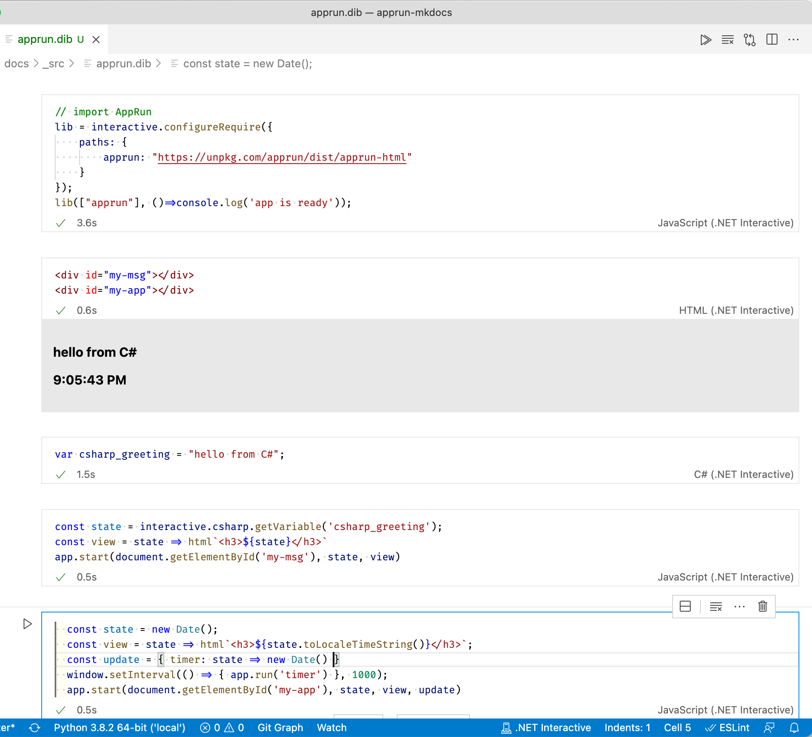

# Notebooks

A notebook interface (also called a computational notebook) is a virtual notebook environment used for literate programming -- wikipedia

Notebooks have a series of cells containing text, code, and visualizations.

## Observable

[Observable](https://observablehq.com) is a website for online JavaScript notebooks.

You can use AppRun on the Observable site by following the steps:

1. Import app, html from @yysun/apprun
2. Create the _state_, _view_, and _update_
3. Create a _div_
4. Start an app on the _div_

Visit https://observablehq.com/@yysun?tab=notebooks for more examples.

## .NET Interactive Notebooks

With the [.NET Interactive Notebooks extension for Visual Studio Code](https://marketplace.visualstudio.com/items?itemName=ms-dotnettools.dotnet-interactive-vscode) installed, we can run the .NET Interactive notebooks in Visual Studio Code. The .NET Interactive notebooks support C#, F#, HTML, JavaScript, Power Shell, and even SQL.

You use AppRun in the .NET Interactive notebooks by following the steps:

1. Import AppRun
2. Create a _div_
3. Create the _state_, _view_, and _update_
4. Start an app on the _div_

[Download the sample notebook](_src/apprun.dib).

