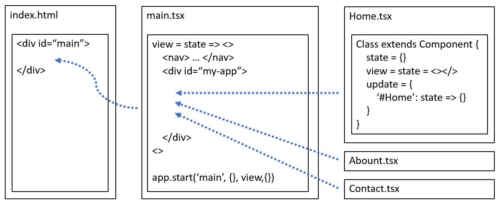

# Single Page Apps

## Create Project

You can initialize a SPA project that uses TypeScript and WebPack.

```sh
npx apprun --init --spa
```

To initialize a project that targets ES5, use the AppRun CLI with the --es5 flag:

```sh
npx apprun --init --spa --es5
```

You can initialize a SPA project that uses esbuild.

```
npx apprun --init --spa --esbuild
```

## SPA Architecture

AppRun SPA usually includes an HTML file, the main program that renders the screen layout, and page components that render the pages.



AppRun SPA uses the events to route user interaction to the components. Treating routing like other web events is the smart idea of AppRun. All web events are unified under the event pub-sub pattern. Routing does not require special treatment.

AppRun components are modularized using the ECMAScript module standard. We can import the modules statically and dynamically. We
can also use the native module from modern browsers.

```
.
├─ dist/
├─ src/
│  ├─ About.tsx
│  ├─ Contact.tsx
│  ├─ Home.tsx
│  ├─ Layour.tsx
│  └─ main.tsx
└─ index.html
```

