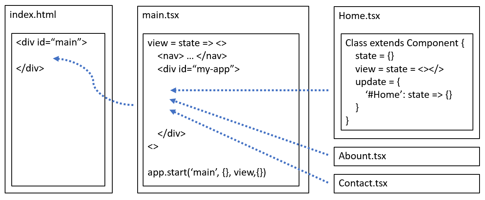

# Single Page Apps

## Create Project

You can initialize a project using the `npm create apprun-app` command and select the `Single Page App` template.

```sh
npm create apprun-app [my-app]
```

## SPA Architecture

AppRun SPA usually includes an HTML file, the main program that renders the screen layout, and page components that render the pages.

```
.
├─ dist/
├─ src/
│  ├─ About.tsx
│  ├─ Contact.tsx
│  ├─ Home.tsx
│  ├─ Layout.tsx
│  └─ main.tsx
└─ index.html
```

Example of the `index.html` file:

```html
<!doctype html>
<html>
<head>
  <meta charset="utf-8">
  <title>AppRun SPA</title>
<body>
  <div id="main"></div>
  <script src="dist/main.js"></script>
</body>
</html>
```

Example of the `main.tsx` file:

```js
import Home from './Home';
import About from './About';
import Contact from './Contact';
import Layout from './Layout';

// The Layout renders the page shell, including the <div id="pages"></div> host.
new Layout().start(document.getElementById('main'));

// Mount every page to the same host element. Each page is activated by its route.
new Home().start('pages');     // start renders the default/home page right away
new About().mount('pages');    // mount waits for its route event
new Contact().mount('pages');
```



AppRun SPA uses the [events](event-pubsub.md) to route user interaction to the components. Treating routing like other web events is the smart idea of AppRun. All web events are unified under the event pub-sub pattern. Routing does not require special treatment.

## Dynamic Component Loading

AppRun components are modularized using the ECMAScript module standard. We can import the modules statically and dynamically. We can also use the native module from modern browsers.

```js
import app from 'apprun';
import Layout from './Layout';

new Layout().start(document.getElementById('main'));

app.on('#/, #/home', async () => {
  const module = await import('./home');
  new module.default().mount('pages');
});

app.on('#/about', async () => {
  const module = await import('./about');
  new module.default().mount('pages');
});

app.on('#/contact', async () => {
  const module = await import('./contact');
  new module.default().mount('pages');
})
```

See [Routing](routing.md) for hash vs. path routing, route parameters, and lazy loading
with `app.addComponents`.


