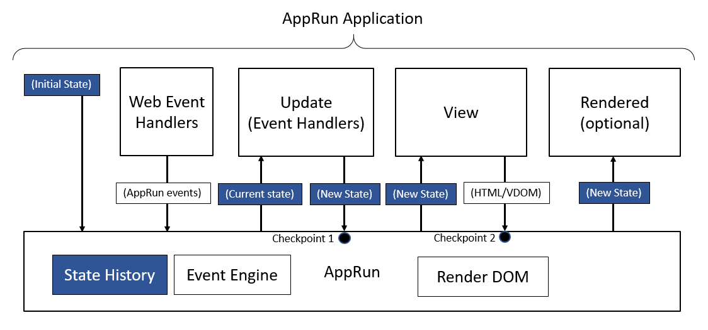

# State Management

The _State_, one of three main parts of the AppRun architecture, plays an essential role in the AppRun event lifecycle. It is the equivalent of the _Model_ of the Elm architecture. Elm defines the Model as the application state. Modal and State are two names of the same thing. Therefore, they are interchangeable in the AppRun architecture. Most of the time, we use the term State in AppRun.

The State is the application state at any given time of your applications. The State is the data flow between Update and View. It acts as the data transfer object (DTO) in traditional multilayered application architecture, where the DTO is an object that carries data between logical and physical layers.

The benefits of using events and DTO like the state is that there are no dependencies between the _view_ and _update (event handlers)_. Thus, it makes the AppRun applications easier to develop, test, and maintain. You can get more information about [unit testing](unit-testing.md) later.

## Initial State

We only need to define the initial state. The initial state is an immutable constant. AppRun manages the state through the event lifecycle.




## Asynchronous State

We can define the initial state as a function. And even an asynchronous function to initialize the state.

```js
// Init State as an Async Function
const state = async () => {
  const response = await fetch('https://xkcd-imgs.herokuapp.com/');
  const comic = await response.json();
  return { comic };
};
const view = state => <>
  { state.comic && }
</>;
app.start(document.body, state, view);
```
<apprun-play style="height:300px"></apprun-play>


## State History

The state can be stored in state history by AppRun. Once the state history is enabled, we can travel through the history back and forth to get the previous and next state. See the sample below.

```js
const state = [];

const Counter = ({num, idx}) => (
  <div>
    <h1>{num}</h1>
    <button onclick={() => app.run("-1", idx)}>-1</button>
    <button onclick={() => app.run("+1", idx)}>+1</button>
    <button onclick={() => app.run("remove-counter", idx)}>x</button>
  </div>
);

const CounterList = ({counters}) => counters.map((num, idx) =>
  <Counter num={num} idx={idx} />
);

const view = (state) => {
  return (
  <div>
    <div>
      <button onclick={() => app.run("history-prev")}> &lt;&lt; </button>
      <button onclick={() => app.run("history-next")}> &gt;&gt; </button>
      <button onclick={() => app.run("add-counter")}>add counter</button>
      <button onclick={() => app.run("remove-counter", state.length-1)}
        disabled={state.length <= 0}>remove counter</button>
    </div>
    <br/>
    <CounterList counters={state} />
  </div>);
};

const update = {
  'add-counter': (state) => [...state, 0],
  'remove-counter': (state, idx) => [
     ...state.slice(0, idx),
     ...state.slice(idx + 1)
   ],
  '+1': (state, idx) => [
    ...state.slice(0, idx),
    state[idx] + 1,
    ...state.slice(idx + 1)
  ],
  '-1': (state, idx) => [
    ...state.slice(0, idx),
    state[idx] - 1,
    ...state.slice(idx + 1)
  ]
};

app.start(document.body, state, view, update, {history: true});
```
<apprun-play style="height:380px"></apprun-play>

Although it is effortless to enable the AppRun state history, the caveat must be immutable. Because in the AppRun state history it stores the references to the states, if we have modified the state directly, each state stored in the state history refers to the same state, which is always the value of the last change. Thus, the time-travel back and forward will not work. Therefore, the fundamental concept of using state history is to make the state immutable.