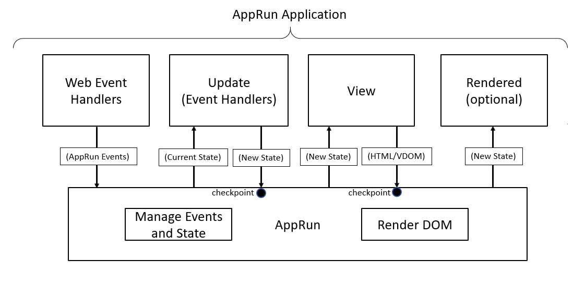

# Strong Typing

From the AppRun architecture and AppRun event life cycle, we can see two places that require strong-typing: state and event names.

* The initial state and the state passed between the view function and event handlers
* The event names for publishing and subscribing Apprun events



## Strong Typing of State

The state are used in the _view_ function and in the _update_(event handlers). We can make the state strong typed in the _view_ function and in the _update_.

### Typed View

First, we can make the state use in the _view_ strongly typed by importing the View type from AppRun and apply it to the view function.

```js
import { app, View } from 'apprun';
const view: View<number> => state => <div>...</div>
```

The View type imported from AppRun is a [generic type](https://www.typescriptlang.org/docs/handbook/2/generics.html). It makes the view function into a generic function, which let us define the type of its parameters. E.g., we define the view function to be View<number>, TypeScript recognizes the state parameter of the view function is number.


### Typed Update

Next, let's import the Update type from AppRun and apply it to the update object.

```js
import { app, View, Update } from 'apprun';
const update: Update<number> = { ... }
```

The Update type imported from AppRun is also generic. It makes the event handlers in the update object into generic functions. TypeScript recognizes the state parameter of the event handler functions are number.


### Typed Application

Finally, let's make the application strongly type. The _app.start_ is a generic function already. If we give the _app.start_ function a type, E.g., number, it means the state of the application is number, the view of the application is View<number> and the update of the application is Update<number>.

```js
app.start<number>( ... )
```

If the type of state does not match the types assigned to the _app.start_ function, TypeScript catches the type error.


If the type of the view function does not match the types assigned to the _app.start_ function, TypeScript catches the type error.


If the type of the update object does not match the type assigned to the _app.start_ function, TypeScript catches the type error.


So far, e have made the strongly typed state to the view function, the event handlers in the update object, and the application. Next, we will move to make strongly typed events.

## Strong Typing of Events

AppRun update object is a named collection or dictionary of the event handlers. The event names are strings, such as +1 and -1. They are not typed, not checked by the compiler, and not IDE friendly. Instead, we can use TypeScript enum to define the event names.

### Enum of Event Names

We define the Events enum and use it in the view functions and the update object.

```js
enum Events { inc = '+1', dec = '-1' }
```


You can see when we type 'Events.', Visual Studio code provides the intelliSense to help us typing. However, you can also see that the string +0 is still allowed in the update object. It is because the object index can only be a number or string. Or as long as a number or string is used, the compiler is happy and has no more type checking.

### Update Tuple

The _update_ can be an array of tuples for defining AppRun event handlers.


The event handler tuple has two fields: the event name and the event handler function.

We can use two advanced TypeScript types with the tuple: union type and string literal type, to create so call discriminated union. For more information about union type, string literal type, and discriminated union, please refer to the TypeScript handbook.

### Discriminated Union Typed Event Names

First, we define a union type called Events, which is made out of two string literal types, -1 and +1.

```js
type Events = '-1' | '+1';
```

Then, we use the Events type as the second generic of the Update type imported from AppRun and apply it to the _update_ tuple.

```js
const update: Update<number, Events> = [ ... ]
```

The event names are strongly typed. TypeScript can even provide code auto-completion (IntelliSense) to hint at the event names.


If the event name is not one of the strings defined in Events type, TypeScript catch the error.


### Typed Events in View

To make the event names in the view function strongly type, we need to make the event names of the application strongly type first. We can add the Events type to the _app.start_ generic function.

```js
app.start<number, Events>(...)
```

It makes the application can only trigger the events that are defined in the Events type. Because we have made the event names strongly typed TypeScript provides intelliSense to the event names the application.


TypeScript also catches the event name errors in the view function.


So far, we have accomplished strong typing for the AppRun global application. Next, we will implement strong typing for AppRun Components.

## Strong Typing of Component

AppRun Component is like a scoped AppRun application. It also has three parts: _state_, _view_, and _update_.

AppRun Component is a generic class. We create our components by extending the AppRun Component class. We can add the state type and events type to the Component class, as well as to the view function and update tuple to make the component strongly typed so that TypeScript can provide IntelliSense and type validation while we are coding.


### Typed Event Decorator
The AppRun @on decorator makes a function in the component class to be an event handler. The @on decorator is also generic. When we add the event type to the @on the decorator, TypeScript recognizes and enforces the event names to be the event type.


### Typed $on Directive

The AppRun [directive](directive.md) is a syntax sugar for JSX. The $on directive is helpful for publishing DOM events to AppRun events. The $on directive can be strongly typed.


## Conclusion
Thanks to TypeScript, we can make AppRun application strong-typed.
